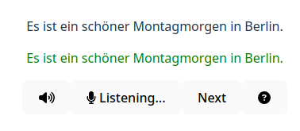

# Reading tool

A tool for the SmarterGerman course A1-B1 levels allowing users to read out loud
and get instant feedback on their pronunciation.



[Demo](https://frp.github.io/reading_tool/)

Only works in [browsers with Speech Recognition support](https://developer.mozilla.org/en-US/docs/Web/API/SpeechRecognition#browser_compatibility).

## Development pointers

To start the tool locally:

```bash
npm run dev
```

To run unit tests:

```bash
npm test
```

## Testing tokenization changes

`golden-report.ts` tokenizes and normalizes all sentences, and you can see the
impact of a tokenization change by comparing its output between two versions.

Steps:

1. Make a change.
2. ```bash
   git stash
   ```
3. ```bash
   npx tsx golden-report.ts https://json-url > old
   ```
4. ```bash
   git stash pop
   ```
5. ```bash
   npx tsx golden-report.ts https://json-url > new
    ```
6. Explore the diff between old and new in your favourite diff tool.